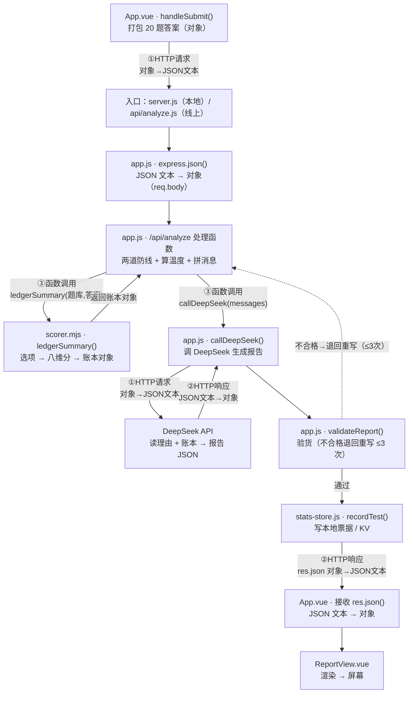

# 系统解剖：不止于MBTI 是怎么运转的

> 写于 2026-08-18 ｜ 配套回忆录：[recap.md](./recap.md)（"我们怎么走到这里的"）
> 本文件回答另一个问题：**这个系统现在长什么样、怎么运转、为什么这么设计**。
> 阅读方式：不需要先懂代码。每个模块都有"是什么 → 怎么运转 → 为什么这么设计"三段，代码引用只当对照物，想深挖时再翻源码。

---

## 1. 一张总图：用户在门店的真实旅程

### 1.1 线上（主图）：用户点开 sherrymouse.top 之后

```
任何一位用户（手机或电脑的浏览器）
 │  打开朋友分享的链接，或输入 https://sherrymouse.top
 ▼
【Vercel · 房间 1】静态托管：把前端页面（index.html + JS/CSS）原样发给浏览器
 │  浏览器拿到画面：封面 → 答题 → 用户点"生成我的报告 ✨"
 │  前端 fetch('/api/analyze')（同域名，没有跨域问题）
 ▼
【Vercel · 房间 2】Serverless 函数 api/analyze.js（vercel.json 把 /api/* 全指到这）
 │  平时睡觉，被敲门才醒；醒来执行 app.js 那套流程：
 │  ① 查票（格式 + key 在不在）② 算选项账本（scorer.mjs 代码算八维分）→ 打电话给 DeepSeek（工作手册 + 答案 + 账本）
 │  ③ 验货（不合格退货重写，最多 3 次）④ 记账（写 KV 账本：原子计数 + 明细票）
 ▼
【DeepSeek】云上的 AI 大脑（deepseek-chat，按次收费）
 │  10~20 秒后交回报告 JSON
 ▼
报告沿原路返回 → 前端渲染报告页 → 用户看到报告
```

| 角色 | 线上住哪 | 干什么 | 不能干什么 |
|---|---|---|---|
| 前端 | 用户的浏览器（页面由 Vercel 静态托管发出） | 收答案、展报告、管画面 | 藏 key（浏览器代码人人可看） |
| 后端 | Vercel 函数（api/analyze.js） | 拼指令、带 key 调 AI、验货、记账 | 画画面 |
| DeepSeek | 云上 | 读答案、写报告 | —— |
| 账本 | Vercel KV（云端仓库） | 记聚合数字 + 明细票据（时间/判型/理由数） | —— |

**用户全程只跟 Vercel 打交道**：你关机、断网，网站照常营业；你唯一的运维动作是 `git push`（代码推上去，Vercel 自动重新部署）。

### 1.2 附：本地开发（"工作室"，只有你自己能看）

同一套流程，你改代码时会在自己电脑上重演一遍：

```
你（浏览器）
 │  打开 http://localhost:5173
 ▼
【Vite 前端店】5173 端口：Vue 画面（和线上同一套代码）
 │  点"生成我的报告"，fetch('/api/analyze')
 ▼  （浏览器不许 5173 的网页直接敲 3001 的门，所以要中转）
【Vite 代理】vite.config.js 里的中转站：把 /api 开头的请求转交 3001
 ▼
【Express 后端店】3001 端口：server.js 开店、app.js 出菜（和线上同一份菜谱）
 │  读 prompt.md、拿 .env 的 key、调 DeepSeek、验货、记账（记本地票据 .stats-events/）
 ▼
【DeepSeek】云上的 AI 大脑（不变）
 ▼
原路返回 → 前端渲染报告页
```

**什么时候会用到它**：开发新功能、试飞脚本（`test:analyze`）、排障（查端口/杀进程）——全在这个工作室里。

**它和线上只有三处不同**：

1. 前端店和后端店分开两个端口（5173/3001），中间多一个 Vite 代理中转站（线上同域名，不需要它）
2. 账本记在本地票据目录 `.stats-events/`（线上记 Vercel KV）
3. 只有你自己能访问；线上全世界都能访问

---

## 2. 一条请求的生命：从点按钮到看到报告

> 本节是"三件套"，按顺序读，各管一件事：
> ① **2.0 路由登记**——门是怎么挂上去的（先搞懂 `app.get` / `app.post` 是什么）
> ② **2.1 一张图看全流程**——旅程全貌 + 数据变身钥匙 + 真实案例（讲给别人听，用这张）
> ③ **2.2 17 步对照表**——每一步的详细落点（对着源码查漏用）

### 2.0 路由登记：5 扇门是怎么挂上去的

**`app.get` / `app.post` 是什么**：它们是**登记动作**。`app.post('/api/analyze', 处理函数)` 的意思是——"在 Express 的登记本上写一笔：将来有人敲门牌号 `/api/analyze`（且方法是 POST），就调用这个处理函数"。**登记不等于执行**：处理函数此刻只是"写在纸上备用"，请求来了才被调用。

**这类写法叫什么**（Web 后端术语，见到不慌）：

| 术语 | 白话 | 对应谁 |
|---|---|---|
| 路由（route） | "门牌号 + 处理流程"的配对 | `app.post('/api/analyze', ...)` 整体 |
| 回调函数（callback） | 先记下来、到时候再调用的函数 | 传给 app.post 的那个 `async (req, res) => {...}` |
| 高阶函数 | 参数里带着"另一个函数"的函数 | `app.post` / `app.get` 本身（`sorted(key=fn)` 里见过同类） |
| 控制反转（IoC） | 脚本里是你调用函数；服务器里是框架调用你的函数 | 整个"登记 → 请求来了才调用"的机制 |

**心智模型（一句话）**：`function` 关键字写的 = 工具箱里的**工具**；`app.xxx` 写的 = 负责"记住工具、到点调用"的**调度器**。脚本里永远是你调用函数，Web 服务器里变成了函数调用你——转过这个弯，后端就通了。

**一扇门的统一解剖图（记住这个模板，5 扇门全是它的不同"填充"）**：

```
一扇门 = 三件事：
  ① 谁敲的（敲门人）      —— 前端某个 fetch / 你的浏览器地址栏 / 外部监控脚本
  ② 门牌号（请求目标）    —— app.xxx('/api/...', 回调) 里登记的那个 URL + 方法
  ③ 门内流水线（回调内部）—— 检查 → 调工具函数 → 用 res 回话（处理顺序）
```

**请求怎么找到门（敲门 → 匹配 → 调用）**：

```
fetch('/api/analyze') 执行          ← 敲门（前端 App.vue 第 137 行 / 脚本 test-analyze.js 第 12 行）
   │ ① 构造请求：方法 POST + 门牌号 /api/analyze + body=JSON
   ▼
Express 收到请求
   │ ② 查登记本：方法 POST？门牌号 /api/analyze？ ✓（对不上 → 404）
   ▼
调用对应的处理函数
   │ ③ Express 自动把 req（请求）和 res（响应）塞给处理函数
   ▼
处理函数干完 → 用 res 把结果发回浏览器（"回话"）
```

**本项目的 5 扇门一览**（都在 `server/app.js`；"谁敲"= 敲门人所在的文件与行号）：

| 门 | 门牌号 | 方法 | 由谁敲（位置 · 时机） | 门内调用了谁 | 干什么 |
|---|---|---|---|---|---|
| 1 | `/api/analyze` | POST | `App.vue` 第 137 行 · 点"生成报告" | `scorer.mjs`·`ledgerSummary` ｜ `app.js`·`callDeepSeek` / `validateReport` ｜ `stats-store.js`·`recordTest` | 出报告（主门） |
| 2 | `/api/feedback` | POST | `ReportView.vue` 第 141 行 · 点"满意/不满意" | `stats-store.js`·`recordFeedback` | 记反馈数字 |
| 3 | `/api/suggest` | POST | `ReportView.vue` 第 173 行 · 提交建议 | `stats-store.js`·`recordSuggestion` | 记建议文字 |
| 4 | `/api/stats` | GET | 地址栏输 `sherrymouse.top/stats` 拿到页面后，`StatsView.vue` 第 55 行 fetch | `stats-store.js`·`readStats` + `readEvents` | 看统计（要口令） |
| 5 | `/api/health` | GET | 外部监控 / 运维脚本（前端不敲） | 无（直接回话） | 心跳检查 |

> **一眼看穿的结构**：只有门 1 调用"业务"函数（scorer / AI 流水线），门 2~4 全是 `stats-store` 的薄包装——因为产品只有一个核心功能（出报告），其他门都是"统计后院"的记账员。门 1 自己也调 `recordTest`，所以 `stats-store.js` 是所有门的"公共后院"。

**门 1 完整展开（唯一复杂的门；其他门只是它的"缩水版"）**—— app.js 第 150 行，回调内部按顺序做：

1. **两道防线**：`answers` 是数组且非空？`DEEPSEEK_API_KEY` 存在？→ 不对就直接 400/500 拒绝
2. **算温度**：数 20 题里填了几题理由 → `temperature = 0.3 + 0.6 × 填写率`（理由越少越保守，防 AI 乱猜）
3. **算账本**：`ledgerSummary(题库, 答案)` → `scorer.mjs`：选项 → 八维分 → 账本 `{top1, top2, gap, zone, derived_type}`（对应 2.1 主图的 E 节点）
4. **拼消息**：system = 工作手册（prompt.md）全文，user = 答案 + 账本
5. **循环（最多 3 次）**（对应 2.1 主图的 D→F→G→F→H→D 一圈）：
   - `callDeepSeek(messages, 温度)` → `app.js` 内部：fetch DeepSeek API（429/5xx 自动重试 2 次、120 秒超时）→ 返回 `{report}` 或 `{error}`
   - `validateReport(报告)` → `app.js` 内部**验货**，检查：**5 个字符串字段**（类型/别称/金句/描述/免责）｜ **functions 恰好 4 项** 且 position 固定为 英雄/父母/永恒少年/阿尼玛·阿尼姆斯 ｜ **score 是 0~100 整数** ｜ **判型与功能栈自洽**（判 INTP 却写 ENTP 的栈 → 打回）｜ **under_pressure 恰好 3 项** ｜ **type_matches 恰好 2 项**（每项 4 字段）
   - 验货不过 → 把"上次输出 + 差评"塞回 messages，让 AI 重写
6. **3 次都没过** → 502"AI 连续 3 次不符合格式要求"
7. **记账**：`recordTest({type, filled, total, margin})` → `stats-store.js`：写本地票据 / KV（失败只记日志，**绝不拦报告**）
8. **回话**：`res.json(报告)` → 发回前端

**门 2~5 的完整逻辑**（都是"检查 → 调一个函数 → 回话"三步，对着上表"门内调用了谁"看）：

- **门 2**：检查 `type` 是字符串且非空、`agree` 是布尔 → `recordFeedback({agree, session})`（like/dislike +1，推一张票）→ `res.json({ok:true})`
- **门 3**：取 `text` 去空格、截断到 500 字，空文本 → 400 → `recordSuggestion({text, session})`（只推一张票）→ `res.json({ok:true})`
- **门 4**：口令校验（`STATS_KEY` 没配 → 503，`?key=` 不对 → 403）→ `readStats()` + `readEvents(50)` → `res.json({...统计, fillRate, events})`
- **门 5**：直接 `res.json({status:'ok'})` —— 就这一句，什么都不查

> ⚠️ **门牌号 ≠ 文件：双层路由（本项目最容易混的一点，一次讲透）**
>
> 项目里有两个"analyze"，它们各管一层，别混：
>
> | | 是什么 | 属于哪层 | 谁匹配它 |
> |---|---|---|---|
> | `/api/analyze`（门牌号） | Express 登记本里的 URL | 应用层 | Express 按它找处理函数 |
> | `api/analyze.js`（文件） | Vercel 的函数入口 | 基础设施层 | Vercel 按 rewrite 规则唤醒它 |
>
> **为什么名字相同？** 巧合（历史遗留）：最初项目只有一个 analyze 接口，文件就叫 analyze.js；后来加了 feedback/suggest/stats，全部塞进同一个文件，没改名。
>
> **文件其实是"所有 /api/\* 的房子入口"**：vercel.json 的 `"/api/(.*)" → "/api/analyze"` 让**任何 /api/xxx 请求都唤醒这个文件**，文件再把请求递给 app.js（Express），由 Express 按 URL 分发到具体处理函数。所以它不只是 analyze 的入口。
>
> **什么必须匹配？** 只有一处：**浏览器 fetch 的 URL 必须等于 app.post 登记的 URL**（都是 `/api/analyze` 这个字符串）——这是应用层契约，与文件名无关。
>
> **改名实验（证明文件名无所谓）**：
> - 把 `api/analyze.js` 改名成 `api/house.js`、vercel.json 的 rewrite 指向 `/api/house` → 网站照常（文件只是入口，分发是 Express 干的）；
> - 把 `app.post('/api/analyze')` 改成 `app.post('/api/foo')`、前端 fetch 不变 → 404（**这才是"必须匹配"的地方**）。

### 2.1 一张图看全流程（主链路版）

**衔接的钥匙**：机器内是"对象"，跨机器是"JSON 文本"。HTTP 只能传文本，所以每次跨机器（前端↔后端、后端↔AI）数据都要"变身"两次：压成 JSON 文本发出去，收到再解析回对象。全项目只有 **3 种手段**（就是下面的图例 ①②③）：① HTTP 请求、② HTTP 响应、③ 函数调用 / 跨文件调用。



**图例（三种"手段"就是全项目所有的衔接方式）：**

| 手段 | 是什么 | 数据形态 |
|---|---|---|
| ① HTTP 请求 | 前端→后端、后端→AI（fetch） | 对象 → JSON 文本 |
| ② HTTP 响应 | AI→后端、后端→前端（res.json） | JSON 文本 → 对象 |
| ③ 函数调用 / 跨文件调用 | 后端内部（app.js 喊 scorer.mjs / stats-store.js） | 对象直接传 |

**读图顺序**：从左上角 A 出发，顺着箭头走到 K。**一句话**：对象 → 文本 → 对象 →（算）→ 对象 → 文本 → 对象 → 屏幕。虚线是"验货失败→退回重写"的循环，最多 3 次。想确认自己读懂了，合上文档默画这张图。

**真实数据案例（docs/test-input.json，线上实跑一次）**：选项账本算出 `gap=0.4 → zone=tie → derived_type=ENTP`（选项信号不足，代码"没把握"）；AI 读完理由（Ti 味很重：q12 一条条核对逻辑、q16 坚持原则不妥协、q18 给最合理方案）后，最终判 **INTP**——**"平手区理由定主辅"在生产环境的真实运行**：账本给默认值，AI 拿理由做最终裁决。

### 2.2 17 步详细对照表（查漏用）

> 这张表和 2.1 主图一一对应：第 1~6 步在前端（A 附近），第 7 步是"敲门"（A→B），第 8~13 步在后端（C→I），第 14~17 步回到前端（J→K）。查漏时：先在图里找节点，再看表里的细节。

| 步 | 发生了什么 | 落点 |
|---|---|---|
| 1 | 用户点"开始测试"，舞台从封面切到答题页 | `App.vue`：`phase = 'answering'` |
| 2 | 20 道题依次渲染（题目长什么样、几个选项、占位文案，全来自数据文件） | `App.vue` 的 `v-for` + `data/questions.json` → `QuestionItem.vue` |
| 3 | 用户点选 + 写理由，答案实时存进容器对象 | `App.vue`：`answers = { q1: {choice, reason}, ... }` |
| 4 | 点"生成我的报告" → 两道前端检查：20 题都选了？核心题（q1/q2）理由填了？ | `App.vue`：`handleSubmit()` |
| 5 | 检查通过 → 画面切"分析中"：小猫踱步/眨眼 + 假进度条（渐近爬升压 94%）+ 4 句文案每 4 秒轮播 | `App.vue`：`phase = 'analyzing'` + `analyzingLines` + `analyzeProgress` |
| 6 | 答案被打包成 AI 认识的格式：题号 + 题干 + 选项字母 + 选项全文 + 理由 | `App.vue`：`buildPayload()`（格式对照 `docs/prompt.md` 第 2 章） |
| 7 | `fetch('/api/analyze')` 发出 | 线上：`vercel.json` 把 /api 指给 `api/analyze.js`；本地开发：`vite.config.js` 代理转交 3001 |
| 8 | 后端两道防线：① 答案是不是数组 ② key 在不在 | `app.js` 的 `/api/analyze`：400 / 500 |
| 9 | 打电话给 DeepSeek：system = prompt.md 全文（后端启动时就读好了），user = 答案 JSON + 选项账本（scorer.mjs 现算） | `app.js`：`callDeepSeek()`（deepseek-chat、temperature 随理由填写率 0.3~0.9、要求只吐 JSON、120 秒超时） |
| 10 | DeepSeek 交卷 → 后端"验货"：字段齐不齐、评分在不在 0~100、数组长度对不对 | `app.js`：`validateReport()`（对照 prompt.md 第 4 章合同） |
| 11 | 不合格？把 AI 上次的输出连同"差评"一起发回去，让它重写；最多 3 次 | `app.js`：`for (let attempt = 0; attempt < 3; ...)` |
| 12 | 3 次都不合格 → 502"AI 连续 3 次输出不符合格式要求"；AI 服务端出问题 → 状态码翻译成人话（401 key 无效 / 402 余额不足 / 429 太频繁） | `app.js`：`hints` 表 |
| 13 | 合格 → 顺手记账：总次数 +1、该类型 +1、理由填写数累加、明细推一张票（记账失败绝不拦报告） | `app.js` → `stats-store.js`：`recordTest()` / `recordFeedback()` |
| 14 | 报告返回前端 → 存一份进浏览器本地（回看用）→ 作废旧报告的"已反馈"戳 → 切报告页 | `App.vue`：`localStorage['last-report']`、`removeItem('feedback-done')`、`phase = 'result'` |
| 15 | 报告页渲染：类型徽章 → 总分 → 金句 → 描述 → 四功能 → 压力篇 → 配对 → 免责 | `ReportView.vue` |
| 16 | 用户点"满意/不满意" → 记一个数字进账本；localStorage 盖戳，一份报告一生只能点一次 | `ReportView.vue`：`sendFeedback()` → `app.js` 的 `/api/feedback` |
| 17 | 任何一步断了 → 失败页：人话错误 + 重试 + 返回修改（答案全保留） | `App.vue`：`catch` → `phase = 'error'` |

**这条流水线的形状**：前端只负责"收数"和"展数"，中间所有"AI 的事"都在后端完成。AI 应用的请求都是这个形状——收数据 → 调 AI → 验货 → 记账 → 展示。

---

## 3. 模块解剖

### 3.1 前端：五幕舞台的导演（App.vue 状态机）

**是什么**：整个网站只有一个页面（SPA），`App.vue` 里的 `phase` 变量决定现在演哪一幕。

| phase | 画面 | 谁能切到这 |
|---|---|---|
| `cover` | 封面（卖点文案 + 开始按钮 + 回看入口） | 刚打开 |
| `answering` | 20 道题 + 进度条 | 点"开始测试" |
| `analyzing` | 小猫动画 + 假进度条 + 轮播文案 | 点"生成报告" |
| `error` | 失败页（错误信息 + 重试 + 返回修改） | 任何一步报错 |
| `result` | 报告页 | 后端返回报告 / 回看上次报告 |

**怎么运转**：`phase` 是一个 Vue 响应式变量——它一变，画面自动换。点按钮的本质就是"改 phase"。

**为什么这么设计**：单页应用（SPA）只有一个 HTML 文件，所有页面切换都是"换幕布"而不是"换房间"，所以必须有一个明确的"现在第几幕"——这就是状态机。这个心智模型可以带到任何前端项目：**先把页面分成几个状态，每个状态一个画面，按钮负责切换**。

另一个小机关：`/stats` 是"门牌"——`isStatsPage` 检查地址栏，是统计页就只演统计页那出戏，其余门牌一律走测试流程（`App.vue` 第 13 行）。

**前端组件速览表**（5 个 .vue 各管一事；"敲的门"对应 2.0 的 5 扇门，两张表互为反向视角）：

| 组件 | 一句话职责 | 关键函数 / 数据 | 敲的门 | 备注 |
|---|---|---|---|---|
| `App.vue`（总导演） | 5 幕舞台切换 + 收集答案 + 提交 | `phase` 状态机、`handleSubmit`、`buildPayload`、假进度条 | 门 1（第 137 行 fetch） | 全项目唯一"大总管" |
| `QuestionItem.vue` | 渲染一道题：题干 + 4 选项 + 理由框 | `props`（question/index/answer） | —（不敲门） | 纯展示，答案直接写进父组件的 answer 对象 |
| `ReportView.vue` | 报告 JSON → 页面 + 分享/反馈/建议 | 八维字典、`totalScore`、`copyShare`、`saveScreenshot`、`sendFeedback`、`sendSuggestion` | 门 2（141 行）、门 3（173 行） | 前端最复杂组件，兼容旧报告格式 |
| `StatsView.vue` | 口令门 → 统计展示 + 10 秒自动刷新 | `load()`（silent 模式）、`sortedTypes`、`groupedEvents` | 门 4（55 行） | 只有管理员看得到 |
| `OrbsBackground.vue` | 背景浮标装饰 | `speed` / `highlight` props | —（不敲门） | 纯视觉，`aria-hidden` |

**三个要点**：① 只有 3 个组件在敲门（App→门 1、ReportView→门 2/3、StatsView→门 4），和 2.0 的表正好互为反向视角；② QuestionItem 和 OrbsBackground 不敲门（一个纯展示、一个纯装饰）——干活的敲门，不干活的安静；③ 确定性内容代码管：ReportView 的八维中文名/颜色是写死的字典，AI 不用拼中文名。

### 3.2 题目：数据不是代码（questions.json + QuestionItem.vue）

**是什么**：20 道题全部写在 `data/questions.json`——题号、题干、选项（字母 + 全文 + **功能标签 + 数值权重**）、理由框占位文案、是不是核心题，都是**数据**。选项上的功能标签就是判型计分的唯一数据源（scorer.mjs 直接读）。`QuestionItem.vue` 是"题型模板"，不管具体题目是什么，拿一道数据就渲染一道。

**怎么运转**：`App.vue` 用 `v-for` 把 20 道题循环喂给 `QuestionItem`，每道题的答案实时写进 `answers` 容器。q1/q2 带 `core: true`——前端拒绝理由为空就提交。

**为什么这么设计**：想改题、换题、调占位文案，只动 JSON 文件，一行组件代码都不用碰。**确定性内容（题目、八维中文名、颜色）交给代码和数据管；不确定性内容（分析、报告文字）才交给 AI**——这是 AI 产品的一条重要分界。

### 3.3 报告渲染：字典在前端，AI 只出内容（ReportView.vue）

**是什么**：把报告 JSON 变成好看的页面。

**怎么运转**：
- **确定性字典写死在前端**：八维缩写 → 中文全称（`FUNCTION_CN`）、八维 → 品牌色（`FUNCTION_COLORS`）。AI 只输出 `"function": "Ti"`，页面自己查字典显示"Ti：内倾思维"并用 Ti 蓝——AI 永远不会拼错中文名或色值。
- **总分 = 阳面四维评分的算术平均**（`totalScore`），前端现算，不靠 AI。
- **光效递减**：四功能按位置（英雄 0.9 → 阿尼玛 0.18）给不同亮度的边框和光晕，用一条 `GLOW_STRENGTH = [0.9, 0.6, 0.38, 0.18]` 搞定。
- **分享两件套**：复制文案（现代剪贴板 API，微信/QQ 内置浏览器不认 → 老式 `execCommand('copy')` 兜底）；保存截图（`html2canvas` 点按钮时才加载，平时不背这个库的包袱）。

**为什么这么设计**：AI 的长处是"写内容"，短板是"记住固定事实"。固定事实全部留在代码里，AI 只负责它擅长的那部分——各干各的强项。

### 3.4 后端掌柜：一页菜谱，四道菜（app.js）

**是什么**：后端全部逻辑都在 `app.js`，但它自己不"开店"（不 listen）。谁开店都行（本地 `server.js`、线上 `api/analyze.js`），同一份菜谱共用。

**四道菜**：

| 接口 | 谁在点 | 干什么 | 保护 |
|---|---|---|---|
| `GET /api/health` | 你/监控 | 心跳检查："我还活着吗" | 无 |
| `POST /api/analyze` | 前端提交答案 | 调 DeepSeek 生成报告（本系统主菜） | 答案格式 + key 检查 |
| `POST /api/feedback` | 报告页反馈按钮 | 满意/不满意各记一笔 | 格式检查 |
| `GET /api/stats` | `/stats` 统计页 | 读账本（附填写的率） | 口令：`?key=` 对上 `STATS_KEY` 才给 |

**为什么这么设计**：一个文件管全部路由，本地和线上共用——不各写一套，改一处两处都生效。这是本次项目里"一份逻辑、两处开店"的核心抽象，也是后面要写的 `stats-store.js` 同一思路。

### 3.5 AI 合同：工作手册（docs/prompt.md v2.7）

**是什么**：给 DeepSeek 的"劳动合同"，后端启动时读进来当 system prompt 全文发给 AI。共六章：

| 章 | 内容 | 为什么要有 |
|---|---|---|
| 1 角色定义 | "你是人格分析师，专精毕比模型" | 定人设，输出风格从这里定调 |
| 2 输入说明 | 答案 JSON + 选项账本 JSON 的字段格式 | 让 AI 知道拿到的是什么 |
| 3 判型规则 | 两区判型+分歧注记（账本区选项说了算 / 平手区理由定主辅 / 分歧提次可能）+ 功能味道表 | 判型方法论（权重表已挪进代码 scorer.mjs，仍是产品核心机密） |
| 4 输出格式 | 报告 JSON 结构（字段名、数组长度、评分区间） | 让 AI 按"合同"交货 |
| 5 质量红线 | 8 条：不引原话、不暴露推断逻辑、反巴纳姆、大胆判断、尊重边界、面向普通读者、术语纪律、金句规范 | 产品红线，条条都是踩过的坑 |
| 6 免责声明 | 固定文案，一字不改 | 合规底线 |

**怎么运转**：`app.js` 启动时 `fs.readFileSync` 读入全文存进 `SYSTEM_PROMPT`，每次调 AI 时放在 `messages[0]`（system 角色）。想改 AI 行为，改这个 md 文件即可，一行后端代码不用动。

**为什么这么设计**：prompt 与代码分离——**写 prompt 的人（你）和写代码的人（我）可以各干各的**。这也是"AI 应用开发 ≠ 写代码"的物理体现：产品的一半灵魂在这个 md 文件里。

### 3.6 验货员：建议与合同的区别（validateReport + 重试循环）

**是什么**：`app.js` 里的 `validateReport()` 函数，按 prompt 第 4 章的合同逐项检查 AI 交的货。

**检查清单**：5 个字符串字段齐不齐（类型、别称、金句、描述、免责）；`type_matches` 是不是恰好 2 项且每项有 kind/type/reason/scene；`functions` 是不是恰好 4 项且位置名恰为英雄/父母/永恒少年/阿尼玛/阿尼姆斯 + 评分是 0~100 整数；四字母与阳面栈自洽（16 型栈表写死在代码里）；压力篇是不是恰好 3 项。

**怎么运转**：不合格 → 把 AI 上次的输出原样附上，再加一条"差评"："你上一次的输出不符合格式要求：……请严格按输出格式重新输出"，让 AI 重写。最多 3 次，全不合格就 502 认栽。

**为什么这么设计（本次项目的核心教训）**：调 DeepSeek 时我们传了 `response_format: json_object`（"只吐 JSON"），但这只是**建议**——AI 吐出的 JSON 长什么样它不管。DeepSeek 暂不支持 schema 强约束（试过，报"unavailable"）。所以：**写在 prompt 里的格式是建议，写在验货函数里的检查是合同。合同不可用（API 不支持）时，就自己当质检员。**

### 3.7 账本与仓库管理员（stats-store.js）

**是什么**：统计账本的"仓库管理员"，对外暴露六个函数：`readStats()` / `readEvents()` / `recordTest()` / `recordFeedback()` / `recordSuggestion()` / `resetStats()`。其他代码（app.js）不关心账本存在哪。

**账本长什么样**：聚合数字 + 明细票据。每笔测试/反馈都往流水里推一张"票"（不含任何原文），统计页实时流水显示最近 50 张：

```json
{ "ts": 1755600000000, "type": "test", "personality_type": "INTP", "reasonFilled": 12, "reasonTotal": 20, "margin": 0.4 }
```

**怎么运转**：`storageMode()` 决定账本放哪：
- 有 KV 变量（`KV_REST_API_URL`/`KV_REST_API_TOKEN`，Upstash 两件套也认）→ 云端 Vercel KV：聚合用 INCR/HINCRBY 原子计数（排队执行，绝不互相覆盖），明细用 RPUSH 推票；
- 本地没配，或有 `STATS_MODE=local` 常驻开关锁住 → 本地票据目录 `.stats-events/`，每笔写一个独立小票文件；
- **在 Vercel 上却都没配 → 宁可报错，也不悄悄写进"睡一觉就丢"的地方**。

**为什么这么设计**：① 隐私红线——只记数字和判型，不记答案；② 换仓库只改这一个文件（2026-08-18 已从 Blob 换成 KV，兑现了这条承诺）；③ 记账失败绝不拦报告（用户没做错任何事，悄悄记日志即可）；④ **记账不自动重试**——INCR 非幂等，命令已生效但响应丢失时重试会把一笔记成两笔，宁可见错（日志喊话）不虚高。

**2026-08-18 的教训（为什么换掉 Blob）**：旧账本是"读旧账 → +1 → 写回"三步，两人同时记账就互相覆盖——正式统计期丢过真实数据（3 位朋友的测试，账本只记到 2 笔）。KV 的 INCR 原子加一从根上杜绝竞态。账本代号 `stats:v1`：重启统计期 = 本地跑 `server/reset-stats.js --yes`（须带 --yes 防手滑），不需要任何后台界面。

### 3.8 开店与叫醒：菜谱的三处用法（server.js / api/analyze.js / vercel.json）

**是什么**：同一份 `app.js` 菜谱，三种"开店"方式：

| 文件 | 什么时候用 | 一句话 |
|---|---|---|
| `server/server.js` | 本地开发 | 常开店：`listen(3001)`，一直开着 |
| `api/analyze.js` | 线上 | 叫醒式：有人敲门才醒，干完继续睡 |
| `vercel.json` | 线上 | 店规：`/api/*` 全指给 analyze.js；`/stats` 指给首页；prompt.md 随函数打包；60 秒超时 |

**怎么运转**：Vercel 的规矩是"api/ 文件夹里每个文件 = 一个网址"。我们只有一个 `analyze.js`，但店规里写了 `/api/(.*)` 全部改道到它——所以 `/api/analyze`、`/api/feedback`、`/api/stats`、`/api/health` 四个网址都由这一个函数接待，内部靠 Express 路由分流。

**一个细节**：店规里 `includeFiles: "docs/prompt.md"` 保证函数醒来时工作手册随行（不然 Vercel 打包时可能漏掉它）；`maxDuration: 60` 是函数寿命上限——所以线上调 AI 的实际超时是 60 秒（本地是 120 秒）。

**为什么这么设计**：serverless 的"来客才醒"省钱（没人测就不花钱），但代价是"睡一觉就失忆"——所以账本必须上云、工作手册必须随行打包。本地和线上共用一个 `app.js`，保证"本地测过什么，线上就是什么"。

### 3.9 计分器：判型的确定性骨架（scorer.mjs，题库 v3.1）

**是什么**：把答案数组按题库的选项级标签（function + weight）累加成八维分数，推导候选主导、前两名分差、区段（账本区/平手区）和四字母类型。app.js（生产）与 type-probe.mjs（回归）共用同一个函数。

**怎么运转**：只计 15 道阳面题，阴影题跳过；每选一个选项，就给该选项标签的功能加上它的权重（I 侧 0.7 / E 侧 0.8）；八维排名取前两名算分差，四舍五入一位后与 0.7 阈值比较定区段（浮点坑已踩过）；四字母公式（2026-08-21 栈约束版）：主导 = 第一名定 E/I，辅助 = 理论合法候选中高分者定 N/S 或 T/F，P/J 由栈自然得出——保证四字母永远包含第一名功能。

**为什么这么设计**：四测证明 AI"整体裁决"在镜面档案上是掷硬币（E 3/8 天花板四轮纹丝不动）；判型是纯算术，交给代码零犯规、可验算，两层诊断一眼分辨"规则错还是执行错"。AI 的判型职责收缩为三件事：平手区读理由定主辅、分歧时提次可能、写报告。

### 3.10 基础设施名词速查：Vercel / KV / Blob / 环境变量

> 这些词不属于"代码"，属于"部署与存储"（云基础设施）。本项目只需**概念级**理解：知道谁是房东、仓库在哪、钥匙怎么配。计网管"网络怎么通"（HTTP/DNS/端口），这一节管"东西放哪、谁管、配置怎么传"。

**三者关系（房东 + 两个仓库）**：

| 名词 | 是什么 | 在本项目干什么 |
|---|---|---|
| **Vercel** | 云平台（房东） | 静态托管前端 + 跑 serverless 函数（api/analyze.js）+ 提供 Storage 仓库 + 管环境变量 |
| **KV** | 键值数据库（Vercel 对 Upstash Redis 的品牌名） | 存统计账本（原子计数 + 流水票） |
| **Blob** | 文件存储（像网盘 / S3） | 曾经存过账本，读改写三步会丢数据，2026-08-18 弃用 |

**为什么账本必须放云端（KV）**：serverless 函数"来请求才启动、干完销毁"（睡一觉就失忆），本地文件不可靠 → 状态必须存在函数外面。

**为什么用 KV 不用 Blob**：Blob 是"整个文件换新"（读-改-写三步，两人撞车丢一笔）；KV 是"单键原子操作"（INCR 一步完成，排队执行）。账本需要频繁 +1 → 选 KV。

**环境变量 / process.env（配钥匙的通道）**：
- `.env` = 本地配置文件（server/.env），启动参数 `--env-file-if-exists` 把它读进进程内存；
- `process.env` = 当前 Node 进程内存里的"环境变量表"，代码用 `process.env.键名` 取值；
- 线上没有 .env 文件：Vercel 后台配置（或 KV 集成自动注入的 `KV_REST_API_URL` / `KV_REST_API_TOKEN`）直接进 process.env；
- **代码永远只读 process.env；.env 只是"本地往 process.env 灌数据"的一种方式。**

**storageMode() 四种分支**（stats-store.js 第 54 行，决定账本存哪）：

1. `STATS_MODE === 'local'` → 锁本地（本地开发常驻开关；**线上绝不能设**，否则函数失忆丢账）
2. 有 KV 地址 + token（`KV_REST_API_*` 或 `UPSTASH_REDIS_REST_*` 两套都认）→ 云端 Redis
3. 在 Vercel 却没配 KV → **报错**（宁可报错，不悄悄写"睡一觉就丢"的文件）
4. 其他 → 本地票据目录 `.stats-events/`

---

## 4. 关键设计决策清单

每条 = 决策 + 原因。这是整个项目"为什么这么做"的浓缩。

| # | 决策 | 为什么 |
|---|---|---|
| 1 | AI 是唯一裁判：选择题不计分，AI 读选项 + 理由判型（2026-08-20 修订：判型算术移交代码账本，见 #29~#31；AI 仍是理由的唯一读者与报告的唯一作者） | 差异化承重墙——选项决定"功能群"，理由决定"主辅顺序"，规则引擎读不懂理由 |
| 2 | 一直用 DeepSeek，不切 Claude | 国内直连可用、已有 key；换模型不是换个字符串，prompt 要重新验收 |
| 3 | prompt 写格式是建议，后端验货重写是合同（最多 3 次） | DeepSeek 不支持 json_schema 强约束，后端自己当质检员兜底 |
| 4 | key 不进 git：.env 本地 + Vercel 环境变量线上；Node 24 原生 `--env-file-if-exists` 读 key | 泄 key = 钱包被刷；原生读 env 免掉 dotenv 依赖 |
| 5 | 跨域用 Vite 代理（本地）、同域部署（线上） | 浏览器禁止 5173 的页面直接敲 3001 的门；上线后同住一个域名自然消解 |
| 6 | 菜谱与开店分离：app.js / server.js / api/analyze.js | 一份逻辑三处开店，本地线上行为一致，改一处两处生效 |
| 7 | vercel.json 把 /api/* 全指向一个函数 | 一个函数管全部接口，部署简单、冷启动成本只付一次 |
| 8 | 统计只记聚合数字 + 明细票据（时间/判型/理由数），账本私密 | 隐私红线（不存答案原文）；票据不含任何原文 |
| 9 | 记账失败不拦报告 | 用户没做错任何事，统计是后院的账，不能挡前厅的客 |
| 10 | 账本仓库抽象成一个文件（stats-store.js） | 本地票据 ↔ 云端 KV，换仓库只改一个文件（2026-08-18 从 Blob 换 KV 已兑现） |
| 11 | 反馈防刷：localStorage 盖戳，一份报告一生一次 | 无登录体系的轻量防刷；隐私模式盖不了戳就算了（数据诚实度优先但不强求） |
| 12 | 报告存 localStorage，封面给"查看上次报告" | 解决"看完报告关页面就得重答一遍"的痛点 |
| 13 | 确定性内容代码管（八维中文名/品牌色/题目数据），AI 只出内容 | AI 会记错固定事实、拼错名字；代码永远分毫不差 |
| 14 | 魔法盒子：文案永不喊 AI，等待文案不泄露内部流程 | 用户买的是"被看懂"，不是"有个 AI 在算"；喊 AI 是自降身价 |
| 15 | temperature 0.8，model deepseek-chat，要求 json_object（生产温度 2026-08-19 起改为随理由填写率 0.3~0.9，见 #27；0.8 为 type-probe 固定口径） | 0 = 刻板 1 = 跳脱，0.8 让报告有点文采又不至于放飞；json_object 至少保证外层是 JSON |
| 16 | 阴影题（3/8/13/15/19）不进判型，只喂压力篇 | 阴影行为是压力指纹，用它判主导功能会带偏；但它让报告"压力下的你"有真材实料 |
| 17 | 3 道感知判断题（q6/q11/q17 ★★★★☆）+ E/I 加权纠偏规则（已随题库 v3.0 退役，由等预算数值制取代，见 #29/#30） | 感知主导型（ENxP/ESxP）在判断大题里只露辅助功能，不加高权重感知题 E/I 必错 |
| 18 | 截图为主、链接为辅的传播策略 | 未备案域名在微信里弹风险提示、不显示卡片；截图分享绕开平台限制 |
| 19 | html2canvas 按需动态加载、剪贴板 API 失败降级 execCommand | 平时不背截图库的包袱；微信/QQ 内置浏览器只认老式 API |
| 20 | 部署第一定律：构建绿勾 ≠ 运行正常 | 四次排障全是"部署后真实请求逼出来的"；日志是黑匣子，遇到就翻 |
| 21 | 账本换 KV 票据制：INCR 原子聚合 + 每笔一张明细票 | Blob 读改写互相覆盖（实战丢过 3 位朋友的测试）；KV 排队加一杜绝竞态，票据天然当流水 |
| 22 | 记账不自动重试 | INCR 非幂等：命令已生效但响应丢失时重试会记两笔；宁可见错（日志）不虚高 |
| 23 | 统计期清零 = `reset-stats.js --yes` + 账本代号 `stats:v1` | 后台删键路线不通（Vercel 不显示已有变量值、Upstash 登不上）；本地一条命令清线上，--yes 防手滑 |
| 24 | `STATS_MODE=local` 锁本地账本 | .env 放进 KV 门卡后本地测试会被误判记线上；常驻开关让本地随便测、不污染正式统计期 |
| 25 | 等待界面假进度条（渐近曲线压 94%）+ 小猫 emoji 动画 | AI 时长不可知，真进度必穿帮；真实信息只有"还没好/好了"，表演永不穿帮 |
| 26 | 统计页 10 秒自动刷新 + 实时流水（最近 50 票） | 展示场景数字要新鲜；票据 = 天然流水，对账不再靠猜 |
| 27 | 温度随理由填写率走：0.3 + 0.6×填写率（0%~100% → 0.3~0.9） | 理由少=信号弱，低温保"稳定地保守"而非随机漂移（空理由漂移实测：ENTP/ESTP/ENTJ 乱跳）；理由写满才放文采 |
| 28 | 四字母↔阳面栈一致性验货（16 型栈表写死在代码） | 判型规则不补丁（题目选项已自带偏好，prompt 层补丁=偏置上修偏置）；消灭"判 INTP 却按 ENTP 解读"的内部矛盾报告 |
| 29 | 判型改"选项优先"：代码算八维账本（scorer.mjs），两区判型+分歧注记——账本区（分差 ≥0.7）选项说了算、平手区（<0.7）理由定主辅、分歧时 description 提次可能 | 四测证明 AI 整体裁决在镜面档案上是掷硬币（E 3/8 天花板四轮不动）；理由天花板实验证明理由是贴线裁判不是翻案工具。确定性算术零犯规、可验算，AI 只在规则内工作 |
| 30 | 题库 v3.0 拆标签：每选项单标一个功能，八维等预算（I 侧 8 槽×0.7 / E 侧 7 槽×0.8，各 5.6） | "感知/判断"题级分桶无科学依据且必成跷跷板（偏判断饿死感知主导 8 型、偏感知饿死判断主导 8 型）；题内四方向留家 + 等预算从根上消灭跷跷板 |
| 31 | type-probe 两层诊断：每档案同时打印代码账本推导与模型判型 | 数值制让判型可程序化验算，"规则错"与"执行错"第一次能分开看，模型犯规当场抓（五测 16/16 零犯规） |
| 32 | 判型公式栈约束（2026-08-21）：四字母由"主导第一名 + 理论合法辅助候选对决"推导，栈表（TYPE_STACKS）挪进 scorer.mjs 单源 | 旧公式四个字母独立决策，脏档案会产出栈里没有第一名的非法类型（Ti 第一却判 INTJ）；栈约束保证理论自洽，16 档案代码级对拍结果零变化 |

---

## 5. 骨架公式：这套结构怎么搬到下一个项目

把本项目的零件名擦掉，剩下的就是 **AI 应用骨架**：

```
前端收数据 → 后端带凭证调 AI → 结构化输出 + 验货 → 指标沉淀 + 展示
```

| 骨架环节 | 本项目的落点 | 换成别的产品时 |
|---|---|---|
| 想清楚再动手 | docs/product-spec.md | 写产品说明书：玩法、红线、里程碑 |
| 教 AI 干活 | docs/prompt.md（合同 + 红线） | 写 prompt 并用真实数据验收，测试先行 |
| 先做画面 | frontend/（假数据跑通） | 画面与 AI 是两件事，一件一件做 |
| 接通大脑 | server/app.js + .env | 后端带 key 调 AI，key 永不进 git |
| 保证交货质量 | validateReport 验货重写 | AI 输出不可信，要么 schema 强约束，要么自己验货 |
| 沉淀效果 | stats-store 只记聚合数字 | 指标 = 理由填写率这类"命根子"，上线前就想好记什么 |
| 上线形态 | Vercel serverless + 同域 | 函数睡一觉失忆 → 状态上云、文件随行打包 |
| 排障习惯 | 日志 + 命令速查表 | 构建绿勾 ≠ 运行正常，遇到就翻黑匣子 |

**判断一个"AI 产品"是不是真 AI 产品的尺子**（本项目第 8 节反思的结晶）：把 AI 拿掉，产品还成立吗？如果纯规则也能干，AI 就是装饰品。本项目的答案：**读理由 + 写个性化报告只有 AI 能干**——差异化就长在这条承重墙上，所以"理由填写率"是命根子指标。（v3.0 修订：判型算术移交代码账本后，AI 的独占区收缩为"读理由定平手 + 写报告"，承重墙依然成立。）

---

## 6. 排障地图：坏了先看哪一环

| 症状 | 第一站 | 接着看 |
|---|---|---|
| 网站打不开 | Vercel 部署状态 / 域名 DNS | 本地 `npm run dev` 对照 |
| 提交后失败页 | 看错误文案：401 key 无效 / 402 余额不足 / 429 太频繁 / 502 AI 出错 | 本地 `.env` 或 Vercel 环境变量 |
| 报告字段缺失/数组变短 | 验货没拦住？看 `validateReport` 检查项 | 调 prompt 第 4 章合同 |
| 统计页 403 | 口令对不对：`?key=` vs `STATS_KEY` | 两端环境变量是否一致 |
| 统计页 503 | 后台没配 `STATS_KEY` | Vercel 环境变量 |
| 反馈点了没反应 | 浏览器 Network 面板看 `/api/feedback` | 账本仓库配置（KV 连接） |
| 统计账要清零 | `server/reset-stats.js --yes`（清线上）/ `--local`（清本地） | 改账本代号 `stats:v1` → `v2` 兜底 |
| 判型质量下降 | `type-probe.mjs` 跑一轮 16 型回归（两层诊断：账本推导 vs 模型判型） | `docs/type-eval.md` 对成绩单 |
| 线上所有 /api/\* 报 FUNCTION_INVOCATION_FAILED（首页正常） | Vercel → 最新 Deployment → Functions → Logs 看崩溃栈 | 最常见：代码 fs 运行时读的文件没进打包——nft 只认静态 import 与 vercel.json includeFiles（2026-08-20 题库 JSON 就栽在这，解法：改静态 import） |
| 本地 3001 端口被占 | `netstat -ano \| findstr :3001` | `taskkill /F /PID <PID号>`（孤儿进程经典坑） |
